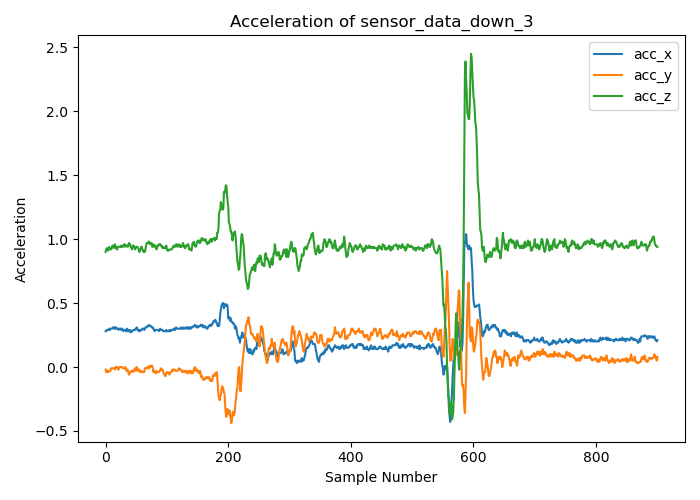

# SVM Classification of accleration and angular velocity data

This repository contains code for the processing and prediction of acceleration, 
gyroscopic, and temperature data from an IMU sensor connected to an ESP32S3. Predictions 
are made about whether a given datset comes from a left, right, up, or down motion.  

- main.c: build and flash to ESP32S3 to output x, y, z acceleration and gyroscope data as well as temperature to monitor
- get_data.py: listens to output from ESP32S3 and outputs to csv files. 
- analyze_data.ipynb: analysis code for IMU data. 
- SVM.ipynb: SVM classification code
- data: all data used in analysis
- figures: all pictures of analyzed data including spectrograms, time series, ect
- Assignment 2 svm report.pdf: assignment report

Time series down gesture:

Fold 2 example confusion matrix:

Down gesture spectrogram:

# Assignment Report

# Data Visualization

The acceleration and angular velocity data of the left, right, up, and down datasets are clearly highly differentiable. Looking at the left datasets, we see a massive drop, then spike, then return to baseline in x axis acceleration data. We also see a massive spike and return to baseline in z axis angular velocity data. This is contrasted in the right dataset with first a massive spike, then a drop, then a return to baseline of x axis acceleration data; and a massive dip and return to baseline in z axis angular velocity data. The order of dips and spikes in the acceleration data can easily be attributed to direction of motion in reference to the axis of measurement in the IMU sensor. The angular velocity data is most likely attributable to some amount of circular motion around the perpendicular axis in the trial, though it is somewhat perplexing. 

The down and up datasets respectively have the same differentiable features as the left and right datasets, only the spike patterns in acceleration occur with the same form but on the z axis, and the spike patterns in angular velocity occur with the same form but on the x axis.

When a spectrogram is applied to this data, differentiation becomes far harder. The order of dips and spikes in acceleration is no longer apparent as the frequency of the wave is shown rather than its amplitude. The same applies for gyroscopic data. This is why amplitude data is fed into the machine learning model rather than frequency data.

# SVM Classification

Initial classification of each gesture resulted in an accuracy of 100%. To validate my results, I instead employed a 5 fold cross validated structure. Data was split into 5 stratified folds, meaning that each fold has roughly the same number of examples of up, down, left, and right gestures. A new classifier was trained and tested 5 times, leaving one fold each time for testing. Mean accuracies, precisions, recalls, and f1 scores were obtained. Precision, recall, and f1 score were calculated using macro averaging for applicability towards multi class scoring. 

# Results:
Average Accuracy Score: 0.9404411764705882
Average Precision Score: 0.9516666666666668
Average Recall Score: 0.9375
Average F1 Score: 0.9375180375180376

# Analysis:
SVM exhibits strong and reliable performance across all metrics, implying strong ability to classify every gesture correctly. 2 right gestures were incorrectly classified as left and down, 2 up gestures were incorrectly classified as left and down, and 1 down gesture was misclassified as up. Left gestures were never misclassified. 

